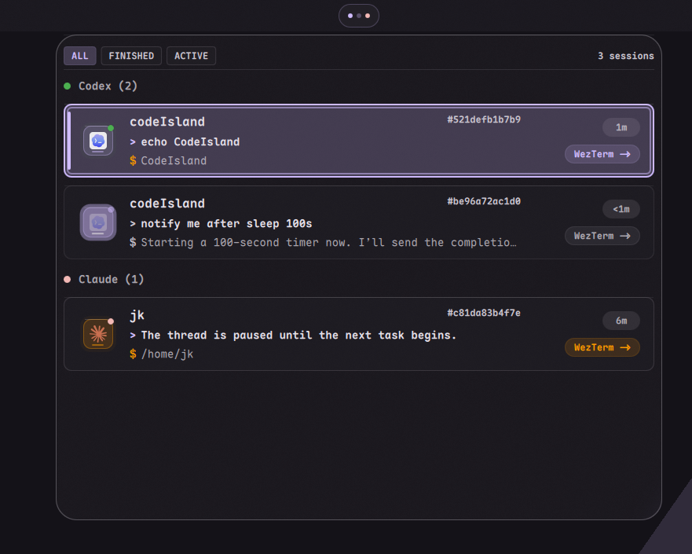
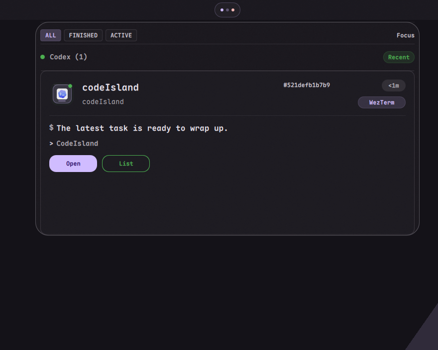

# CodeIsland

CodeIsland is a DankMaterialShell widget plugin for projecting local AI coding
sessions on Wayland/niri. The plugin renders the DMS bar island and popout UI;
the live session data comes from the Linux daemon in `linux-skeleton/`.

## Preview

These screenshots show the plugin running as a DMS widget on niri.

| Running task | Finished task |
| --- | --- |
|  |  |

## Repository Layout

- `plugin.json` - DMS widget manifest.
- `CodeIslandWidget.qml` - plugin root loaded by DMS.
- `CodeIslandSettings.qml` - DMS settings page.
- `components/` - reusable QML UI components.
- `assets/` - provider SVG icons.
- `lib/` - projection, style, and plugin-local i18n helpers.
- `preview/` - standalone QML preview fixtures.
- `linux-skeleton/` - daemon, hooks, adapters, and tests for live Codex,
  Claude Code, and OpenCode session data.

## Runtime Model

The plugin treats `linux-skeleton/codeisland_linux/` as the source of truth.

- It subscribes to the daemon over the Unix socket API.
- It renders the current session by projecting `snapshot.full` and `snapshot.patch` payloads.
- It prefers the daemon-provided `island_state` projection so approvals, questions, and recent completions become focused Code Island cards instead of passive list rows.
- It groups expanded sessions by provider/source, including OpenCode and Codex when the daemon snapshot carries provider metadata.
- It sends approval/question responses back through `interaction_respond`.
- It does **not** move session lifecycle or business logic into the QML plugin.

## Socket Path

The widget uses the same daemon path convention as the Linux skeleton:

- `$XDG_RUNTIME_DIR/codeislandd.sock`
- fallback to `/tmp/codeisland-<uid>/codeislandd.sock` when `XDG_RUNTIME_DIR` is unavailable

You can override the socket path from the plugin settings if your development environment uses a custom path.

## Settings

The plugin settings expose:

- language (`System`, `English`, or `Chinese (Simplified)`) for plugin settings
  and the static widget UI
- default list tab (`Finished`, `Active`, or `All`)
- optional popout when an agent tool finishes
- font family and board/focused popout dimensions
- session card height, spacing, and roundness
- action button roundness and outline strength
- DMS bar dot size, spacing, and breathing motion
- provider group headers, time chips, and terminal/app chips

## Install For DMS

Symlink or copy this directory to your DMS plugins directory:

```bash
mkdir -p ~/.config/DankMaterialShell/plugins
ln -sfn /path/to/codeIsland ~/.config/DankMaterialShell/plugins/codeIsland
```

Then scan plugins in DMS settings, enable `CodeIsland`, and add it to the bar.

## IPC Entry Points

The widget supports DMS widget IPC modes:

```bash
dms ipc widget toggle codeIsland
dms ipc widget openWith codeIsland all
dms ipc widget openWith codeIsland finished
dms ipc widget openWith codeIsland active
```

The popout handles keyboard navigation while it is focused:

- `1` / `2` / `3` switch to `ALL` / `FINISHED` / `ACTIVE`.
- `Tab` and `Shift+Tab` cycle view modes.
- `j` / `k` or arrow up/down move the selected session.
- `Enter` opens the selected or focused session.
- `Esc` closes the popout.
- Approval cards accept `a` for approve and `d` for deny.

## Inspiration

This DMS plugin is inspired by the original
[CodeIsland](https://github.com/wxtsky/CodeIsland) project. It keeps the island
interaction model while adapting the UI and live session bridge for Linux,
Wayland, niri, and DankMaterialShell.
